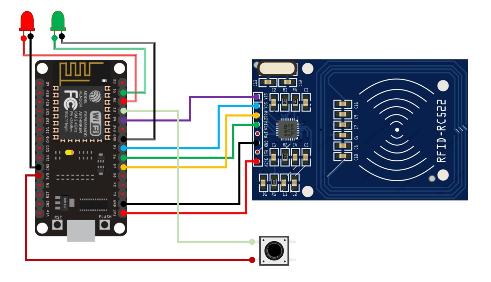

# SAP Mission Control Digital Twin - Emergency Stop NodeMCU

[[_TOC_]]

# Documentation/Readme

We use the Readme file of a project as a central starting point for a developer to onboard himself on that application. We do understand that it's impossible to maintain the entire business and application context for an application in this file. Because of that we have the following recommendations of what a Readme file should contain:

## Description

Liquid Studio created a proof of concept using the services of SAP Cloud Foundry, SAP Destination, SAP Services that are provided by SAP Business Technology Platform, SAP HANA Cloud, 3D animations and 3D models in applications implemented in JavaScript consuming React resources, open source JavaScript front-end library focused on creating user interfaces on web pages. Finally, these applications are consumed in a SAPUI5 application, generating a single application.

This project consists of a supply chain mission control using a multi-site reseller.

This version includes a tropicalized version of the Factory and Workshop models.

Thinking about a better interaction with the application, we implemented a NodeMCU to simulate an emergency stop button for simulated robots in Digital Twin.

## How to run

-   From the Arduino IDE, access the code stored in this repository.

Update the variables responsible for the WiFi connection between lines 33 and 35:
```
    // Constants - WiFi configuration
    const char* cId = "Nome_da_Rede";
    const char* cPassword = "Senha_do_WIFI";
```

On line 124 we have the function call fnPOSTRequest, where the object that will be the body of the POST request is passed to determine that the equipment is working. This functionality is performed by reading the RFID tag.
```
    fnPOSTRequest("{\"EQUIP_ID\":1,\"EQUIP_STATUS\":0}", 0);
```

And on line 141 we have the function call fnPOSTRequest again, however, now passing the object that will be the body of the POST request to determine that the equipment is NOT working. This functionality will be executed as soon as the button is pressed.
```
    fnPOSTRequest("{\"EQUIP_ID\":1,\"EQUIP_STATUS\":1}", 1);
```

## How to deploy

-   Connect NodeMCU with USB cable and deploy.

-   It is possible to validate the application's functionalities from the Arduino IDE Monitor.
```
    Tools >> Serial Monitor
```

## Services/APIs

N/A

## Request

N/A

## Reference Application

Diagram:
[NodeMCU + RFID](https://dev.azure.com/LiquidStudiosBrazil/SAP/_git/ls_mssionCtrl_cpp_emergencyStopNodeMCU?path=/NodeMCU_Parada_de_Emerg%C3%AAncia.jpg)



## External Related applications/Dependencies

N/A

## API Management - Policies configuration

N/A

## Libraries
>*  SPI
>*  MFRC522
>*  ESP8266WiFi
>*  WiFiClient
>*  WiFiClientSecure
>*  ESP8266mDNS
>*  ESP8266HTTPClient

## Contribute
N/A